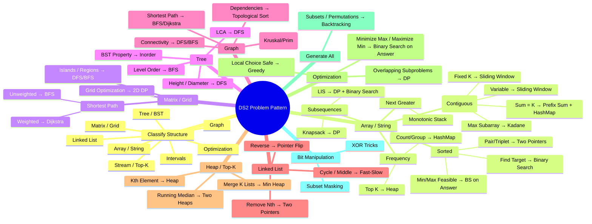
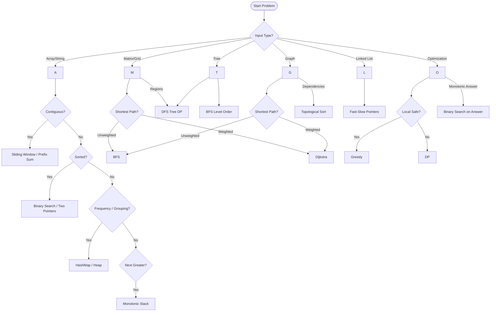

# DSA Interview Prep: The Ultimate Playbook

Welcome to my DSA operating manual. This repository is built to help me approach any coding interview problem, recognize patterns instantly, derive solutions logically, write bug-free Python code, and explain it clearly under pressure.

---

## 1) Repo Philosophy

This repository is designed for **active recall and spaced repetition**, not passive reading.

### How to Use Daily
- **Learn:** Study a pattern and understand its core invariant.
- **Practice:** Solve 1-2 new problems using the 8-Step Method.
- **Review Mistakes:** Log every bug or optimal solution missed in the Mistake Log.
- **Spaced Repetition:** Revisit flagged problems at 1d / 3d / 7d / 14d intervals.

### Repository Structure
- Files are grouped by **Pattern** folders (e.g., `Sliding Window/`, `Graphs/`).
- Python files are named clearly (e.g., `permutation_in_string.py`).
- Add metadata at the top of each file (Time/Space complexity, Pattern used, Key Intuition).

### Pre-Interview Revision
- **4 Hours Before:** Review the **Template Bank** and **Final Checklist**. Do *not* solve new problems.
- **1 Day Before:** Review the **Mistake Log** and practice 2-3 "Pattern Confusion Pairs" (e.g., Backtracking vs. DP) on a whiteboard while talking aloud.

---

## 2) Universal DSA Approach (The 8-Step Method)

Use this repeatable framework for **every single problem** to stay grounded when the timer starts.

1. **Restate problem + input/output + constraints.**
   - *Speak aloud:* "Just to make sure I understand, the input is X, the expected output is Y, and the constraints are Z. For example, if array is empty, I return 0."
2. **Run 2 examples manually.**
   - *Speak aloud:* "Let's trace Example 1. If we have `[1,2,3]`, my logic would do..."
3. **Identify brute force.**
   - *Speak aloud:* "The naive approach would be nested loops, which is O(N^2) time and O(1) space. We can likely optimize this by looking at..."
4. **Identify pattern signals.**
   - *Speak aloud:* "Since the array is sorted and we're looking for pairs, this strongly signals Two Pointers or Binary Search."
5. **Choose data structures.**
   - *Speak aloud:* "I'll use a Hash Map to store frequencies, giving O(1) lookups."
6. **Write invariants / correctness argument.**
   - *Speak aloud:* "The core idea is that my `left` pointer maintains X, while `right` expands until Y."
7. **Code skeleton first, then fill.**
   - *Speak aloud:* "I'll start by checking edge cases, then set up the main loop and logic." (Write clear, modular code).
8. **Test edge cases and complexity.**
   - *Speak aloud:* "Let's dry run this with an edge case like `n=1`. The time complexity is O(N) because... and space is O(N) because..."

---


## 2.5) Plots





## 3) Pattern Identification Decision Tree (DS2 – 30 Min Version)

When stuck, classify the problem in <60 seconds.

### Step 1 — Identify Structure

- Array / String
- Matrix / Grid
- Tree / BST
- Graph
- Linked List
- Intervals
- Stream / Top-K
- Optimization (min/max)
- Generate all combinations

**Then ask:**

- Contiguous or non-contiguous?
- Sorted?
- Need shortest path?
- Need top-k?
- Count ways?
- Multiple queries?

### A) Array / String

**1. Subarray / Substring (Contiguous)**
- **Signals:** subarray, substring, continuous, consecutive, window
- Fixed size k → **Fixed Sliding Window**
- Variable size with condition → **Sliding Window**
- Sum = k (negatives allowed) → **Prefix Sum + HashMap**
- Max subarray → **Kadane (DP 1D)**
- Many range queries → **Prefix Sum**
- Range query + updates → **Fenwick / Segment Tree**

**2. Sorted Array**
- **Signals:** sorted, rotated, kth, minimum possible
- Find target → **Binary Search**
- First/last occurrence → **Binary Search (lower/upper bound)**
- Minimize/maximize answer → **Binary Search on Answer**
- Pair/triplet sum → **Two Pointers**
- Rotated array → **Modified Binary Search**

**3. Frequency / Grouping**
- **Signals:** frequency, anagram, duplicate, distinct
- Count/group → **HashMap**
- Unique check → **HashSet**
- Top K frequent → **Heap / Bucket Sort**

**4. Next Greater / Span Problems**
- **Signals:** next greater/smaller, nearest, span
- → **Monotonic Stack**

**5. Intervals**
- **Signals:** overlap, merge, meeting rooms
- → **Sort + Merge**
- → **Sweep line / Heap** (min rooms)

**6. Subsequences (Not Contiguous)**
- **Signals:** subsequence, choose elements
- LIS → **DP + Binary Search**
- Subset sum / knapsack → **DP**
- Count subsequences → **DP**

### B) Matrix / Grid

**1. Shortest Path**
- Unweighted → **BFS**
- Weighted → **Dijkstra**
- 0/1 weights → **0-1 BFS**

**2. Islands / Regions**
- **Signals:** connected, island, fill
- → **DFS / BFS**
- → Dynamic connectivity → **Union Find**

**3. Grid Optimization**
- **Signals:** number of ways, min path
- → **2D DP**

### C) Tree / BST

**1. Tree Properties**
- **Signals:** height, diameter, path sum
- → **DFS (postorder)**

**2. Level Order / Distance**
- → **BFS**

**3. BST-Specific**
- Inorder sorted property
- Kth smallest → **Inorder**
- Validate BST → **Range check**

### D) Graph

**1. Connectivity / Components**
- → **DFS / BFS**

**2. Shortest Path**
- Unweighted → **BFS**
- Weighted → **Dijkstra**
- Negative edges → **Bellman-Ford**

**3. Dependencies**
- **Signals:** prerequisite, order
- → **Topological Sort**

**4. Connect All Nodes (Minimum Cost)**
- → **MST (Kruskal + DSU / Prim)**

### E) Linked List

- Cycle / middle → **Fast-Slow pointers**
- Reverse → **pointer manipulation**
- Remove nth from end → **Two pointers gap**
- Merge sorted lists → **Two pointers**

### F) Heap / Top-K / Stream

- **Signals:** kth, top k, stream, closest k
- Kth largest → **Heap / Quickselect**
- Running median → **Two Heaps**
- Merge k sorted lists → **Min-Heap**
- Scheduling problems → **Heap**

### G) Greedy vs DP

**Greedy**
- If local optimal choice is provably safe.
- **Signals:** minimum intervals, jump game, activity selection

**DP**
- If overlapping subproblems exist.
- **Signals:** maximize/minimize, count ways, constraints
- Common DP types:
  - Take/Skip
  - Knapsack
  - Grid DP
  - Interval DP
  - Tree DP

### H) Backtracking

- **Signals:** generate all, permutations, combinations
- → **Backtracking + pruning**

### I) Bit Manipulation

- **Signals:** XOR, masks, subset small n
- XOR tricks
- Bit masks for subsets
- Toggle/check bits

### J) Trie / String Matching

- **Signals:** prefix search, dictionary
- → **Trie**
- Advanced: **KMP / Rabin-Karp**

### K) Binary Search on Answer (High DS2 ROI)

- **Signals:** minimize maximum, maximize minimum
- If feasibility check is monotonic:
  - → **Binary search over answer**
  - → Feasibility usually greedy or BFS

### Confusion Resolver (Rapid Decision)

- **Sliding Window vs Prefix Sum**
  - → Sliding window works if window can shrink/grow monotonically.
  - → Prefix sum works with negatives.
- **BFS vs DFS**
  - → BFS = shortest path (unweighted).
  - → DFS = structure / recursion.
- **Heap vs Sort**
  - → Need dynamic top-k → Heap
  - → One-time ranking → Sort
- **Greedy vs DP**
  - → Can prove local choice safe? Greedy.
  - → Otherwise DP.

### 60-Second Interview Mental Script

1. What is input structure?
2. Contiguous or not?
3. Sorted?
4. Need shortest path?
5. Optimization or counting?
6. Any monotonic property?
7. Can I reduce to known template?

---

## 4) Pattern Catalog (Core)

### Arrays & Hashing
- **Signals:** Counting frequencies, grouping anagrams, fast lookups (O(1)).
- **Core invariant:** State is stored in a hash map/set so we don't need to rescan the array.
- **Common bugs:** Forgetting to handle missing keys (`dict.get(key, 0)` or `collections.defaultdict`).
- **Template code (Python):**
  ```python
  from collections import Counter
  def two_sum(nums, target):
      # Hash Map for O(1) lookups
      hash_map = {}
      for i, n in enumerate(nums):
          if target - n in hash_map:
              return [hash_map[target - n], i]
          hash_map[n] = i
  ```
- **Time/Space:** O(N) Time, O(N) Space.
- **Classic problems:** Two Sum, Valid Anagram, Group Anagrams, Top K Frequent Elements.
- **How to explain:** "By trading O(N) space for a hash map, we can reduce our time complexity from O(N^2) to O(N) since we get O(1) lookups."

### Two Pointers
- **Signals:** Sorted arrays, palindromes, finding pairs/triplets, removing duplicates in-place.
- **Core invariant:** Two iterators bounding the problem space shrink towards each other or move in parallel.
- **Common bugs:** Off-by-one errors (`<=` vs `<`), updating pointers inside the wrong condition block.
- **Template code (Python):**
  ```python
  def two_pointers(nums, target):
      left, right = 0, len(nums) - 1
      while left < right: # strict inequality prevents picking same element twice
          curr_sum = nums[left] + nums[right]
          if curr_sum == target:
              return [left, right]
          elif curr_sum < target:
              left += 1
          else:
              right -= 1
  ```
- **Time/Space:** O(N) Time, O(1) Space.
- **Classic problems:** Valid Palindrome, 3Sum, Container With Most Water.
- **How to explain:** "Since the array is sorted, we can safely prune the search space. If our sum is too small, we increment the left pointer. If it's too big, we decrement the right pointer."

### Sliding Window
- **Signals:** "Longest/Shortest subarray", "Subarray size K", contiguous sequences.
- **Core invariant:** A valid window from `left` to `right`. We always expand `right`, and if the window becomes invalid, we shrink `left` until it is valid again.
- **Common bugs:** Updating the max/min length inside the `while` loop when it should be outside, or vice versa depending on validity.
- **Template code (Python):**
  ```python
  def sliding_window(nums, k):
      left = 0
      best = 0
      window_state = 0 # sum, map, etc.
      
      for right in range(len(nums)):
          window_state += nums[right] # expand window
          
          while not is_valid(window_state): # shrink if invalid
              window_state -= nums[left]
              left += 1
              
          best = max(best, right - left + 1) # update result when valid
      return best
  ```
- **Time/Space:** O(N) Time, Space depends on window state (O(1) to O(K)).
- **Classic problems:** Longest Substring Without Repeating Characters, Minimum Window Substring.
- **How to explain:** "I'll use a sliding window. I'll expand my right pointer to include elements. When my window violates the condition, I'll shrink it from the left until it's valid again, keeping track of the optimal size along the way."

### Prefix Sum
- **Signals:** Multiple queries for subarray sums, continuous subarray sums divisible by K.
- **Core invariant:** `sum(i, j) = prefix[j] - prefix[i-1]`.
- **Common bugs:** Handling the base case correctly (initializing prefix map with `{0: 1}` or `prefix[0] = 0`).
- **Template code (Python):**
  ```python
  def subarray_sum(nums, k):
      prefix_counts = {0: 1} # base case: mapping prefix sum to its frequency
      curr_sum = 0
      res = 0
      
      for n in nums:
          curr_sum += n
          if curr_sum - k in prefix_counts:
              res += prefix_counts[curr_sum - k]
          prefix_counts[curr_sum] = prefix_counts.get(curr_sum, 0) + 1
      return res
  ```
- **Time/Space:** O(N) Time, O(N) Space.
- **Classic problems:** Subarray Sum Equals K, Continuous Subarray Sum.
- **How to explain:** "Instead of recalculating the sum of subarrays, I'll maintain a running prefix sum. If `current_sum - target` exists in my hash map, it means there's a valid subarray ending here."

### Binary Search
- **Signals:** Sorted arrays, finding a target in O(log N), "minimized maximum" or "maximized minimum" (BS on answer).
- **Core invariant:** The search space is strictly partitioned.
- **Common bugs:** Infinite loops (`left = mid` without `mid = (left+right+1)//2`), returning wrong pointer at the end.
- **Template code (Python):**
  ```python
  def binary_search(nums, target):
      left, right = 0, len(nums) - 1
      while left <= right:
          mid = left + (right - left) // 2 # strictly better than (left + right) // 2 
          if nums[mid] == target:
              return mid
          elif nums[mid] < target:
              left = mid + 1 # Target is strictly to the right
          else:
              right = mid - 1 # Target is strictly to the left
      return -1
  ```
- **Time/Space:** O(log N) Time, O(1) Space.
- **Classic problems:** Search in Rotated Sorted Array, Koko Eating Bananas, Time Based Key-Value Store.
- **How to explain:** "Since we have a sorted search space, we can cut our search in half each iteration by comparing the middle element."

### Stack (Monotonic Stack)
- **Signals:** "Next Greater Element", "Daily Temperatures", parsing histograms.
- **Core invariant:** The stack strictly maintains a decreasing or increasing order.
- **Common bugs:** Pushing the value instead of the index (indices are better for calculating distances).
- **Template code (Python):**
  ```python
  def next_greater_elements(nums):
      res = [-1] * len(nums)
      stack = [] # holds indices
      
      for i, n in enumerate(nums):
          # maintaining strictly decreasing stack
          while stack and nums[stack[-1]] < n:
              idx = stack.pop()
              res[idx] = n
          stack.append(i)
      return res
  ```
- **Time/Space:** O(N) Time, O(N) Space.
- **Classic problems:** Daily Temperatures, Largest Rectangle in Histogram.
- **How to explain:** "I'll use a stack to keep track of elements we haven't found a 'next greater' for yet. As soon as I see a larger element, I pop all smaller elements from the stack and update their answers."

### Heap / Priority Queue
- **Signals:** "Top K", "Kth Largest/Smallest", merging K sorted lists, dynamic median.
- **Core invariant:** Elements are ordered globally partially, giving O(1) access to min/max.
- **Common bugs:** Python's `heapq` is a Min-Heap. For Max-Heap, you must push `-value` and negate upon popping.
- **Template code (Python):**
  ```python
  import heapq
  
  def top_k(nums, k):
      min_heap = []
      for n in nums:
          heapq.heappush(min_heap, n)
          if len(min_heap) > k:
              heapq.heappop(min_heap) # pop smallest to maintain largest K
      return [x for x in min_heap]
  ```
- **Time/Space:** O(N log K) Time, O(K) Space.
- **Classic problems:** Kth Largest Element in an Array, Find Median from Data Stream.
- **How to explain:** "I'll maintain a min-heap of size K. When processing elements, I add to the heap and pop if it exceeds K. This leaves exactly the K largest elements in O(N log K) time."

### Trees (DFS / BFS)
- **Signals:** Binary Search Tree properties, level-order mapping, Lowest Common Ancestor.
- **Core invariant:** DFS goes deep (recursion/stack), BFS goes wide (queue).
- **Common bugs:** Not handling `null` / `None` node properly at the base case.
- **Template code (Python):**
  ```python
  # DFS
  def dfs(root):
      if not root: return 0
      left = dfs(root.left)
      right = dfs(root.right)
      return 1 + max(left, right)
      
  # BFS
  from collections import deque
  def bfs(root):
      if not root: return []
      q = deque([root])
      res = []
      while q:
          level = []
          for _ in range(len(q)): # pop entirely this level
              node = q.popleft()
              level.append(node.val)
              if node.left: q.append(node.left)
              if node.right: q.append(node.right)
          res.append(level)
      return res
  ```
- **Time/Space:** O(V) Time, O(H) Space for DFS, O(W) Space for BFS.
- **Classic problems:** Maximum Depth, Subtree of Another Tree, Level Order Traversal.
- **How to explain:** "I'll use a recursive DFS approach. At each node, my base case is null returning X. Then I recursively process the left and right children and combine their results."

### Graphs (BFS/DFS, Union Find, Topological Sort)
- **Signals:** Grids/matrices, shortest path (BFS), connected components (DFS/Union Find), prerequisite tasks (Topological Sort).
- **Core invariant:** Must track `visited` nodes to prevent infinite loops (cycles).
- **Common bugs:** Forgetting to mark a node as visited *when adding to queue* in BFS instead of when popping (causes duplicate queue entries).
- **Template code (Python):**
  ```python
  # Topological Sort (Kahn's)
  from collections import deque, defaultdict
  def topo_sort(numCourses, prerequisites):
      adj = defaultdict(list)
      indegree = {i: 0 for i in range(numCourses)}
      
      for crs, pre in prerequisites:
          adj[pre].append(crs)
          indegree[crs] += 1
          
      q = deque([c for c in indegree if indegree[c] == 0])
      res = []
      
      while q:
          curr = q.popleft()
          res.append(curr)
          for nei in adj[curr]:
              indegree[nei] -= 1
              if indegree[nei] == 0:
                  q.append(nei)
                  
      return res if len(res) == numCourses else [] # Detect cycle
  ```
- **Time/Space:** O(V + E)
- **Classic problems:** Number of Islands, Course Schedule, Clone Graph.
- **How to explain:** "This is a dependency graph, so I'll apply Kahn's algorithm for Topological sort. I'll track in-degrees, process nodes with 0 in-degrees, and peel back the edges, checking if I processed all nodes at the end to detect cycles."

### Backtracking
- **Signals:** "Find all permutations/combinations/subsets", exhaustive search.
- **Core invariant:** Explore a path, add to result if valid, then UNDO the choice (backtrack) to explore other paths.
- **Common bugs:** Appending a reference to the list (`res.append(path)`) instead of a copy (`res.append(path.copy())`).
- **Template code (Python):**
  ```python
  def subsets(nums):
      res = []
      def backtrack(i, path):
          if i >= len(nums):
              res.append(path.copy()) # COPY!
              return
          
          # Decision 1: include nums[i]
          path.append(nums[i])
          backtrack(i + 1, path)
          path.pop() # Backtrack (undo)
          
          # Decision 2: NOT include nums[i]
          backtrack(i + 1, path)
          
      backtrack(0, [])
      return res
  ```
- **Time/Space:** O(2^N) or O(N!) Time, O(N) Space.
- **Classic problems:** Combination Sum, Word Search, N-Queens.
- **How to explain:** "I'll use backtracking to explore all possible subsets. At each index, I make a decision tree: one branch where I include the element, and one where I skip it."

### Dynamic Programming (1D / 2D)
- **Signals:** "Maximum / Minimum", "Number of ways", DP requires overlapping subproblems + optimal substructure.
- **Core invariant:** `dp(state) = optimal_choice( dp(state_A), dp(state_B) )`.
- **Common bugs:** Index out of bounds, getting base cases wrong, TLE if top-down isn't memoized.
- **Template code (Python):**
  ```python
  # Top-Down with Memoization
  def climbStairs(n):
      memo = {}
      def dfs(i):
          if i > n: return 0
          if i == n: return 1
          if i in memo: return memo[i]
          
          memo[i] = dfs(i + 1) + dfs(i + 2)
          return memo[i]
      return dfs(0)
  ```
- **Time/Space:** O(States * Transitions) Time.
- **Classic problems:** Climbing Stairs, House Robber, Coin Change, Edit Distance.
- **How to explain:** "This problem has overlapping subproblems. I'll map out the recursive state tree, then observe that many states repeat. By caching results in a memo dictionary, I bring the time complexity down from exponential to polynomial."

### Intervals
- **Signals:** Overlapping meetings, merging intervals, sweep line.
- **Core invariant:** Sort by start time. A merge is required if `prev[1] >= curr[0]`.
- **Template code (Python):**
  ```python
  def merge_intervals(intervals):
      if not intervals: return []
      intervals.sort(key=lambda x: x[0])
      res = [intervals[0]]
      
      for start, end in intervals[1:]:
          last_end = res[-1][1]
          if start <= last_end: # Overlap
              res[-1][1] = max(last_end, end) # Merge
          else:
              res.append([start, end])
      return res
  ```
- **Time/Space:** O(N log N) Time, O(N) Space.
- **Classic problems:** Minimum Number of Arrows to Burst Balloons, Merge Intervals, Non-overlapping Intervals.
- **How to explain:** "First, sorting the intervals by start time gives us a chronological order. Then we only need to compare the current interval with the last interval we added to our result set, merging them if they overlap."

### Linked List
- **Signals:** Disconnected nodes, middle of list, cycle detection, reverse list.
- **Core invariant:** Keep track of the nodes you lose connection to, pointer references update.
- **Common bugs:** Losing reference to the `head` node, infinite loops in cycles.
- **Template code (Python):**
  ```python
  # Fast and Slow Pointer
  def hasCycle(head):
      slow, fast = head, head
      while fast and fast.next:
          slow = slow.next
          fast = fast.next.next
          if slow == fast:
              return True
      return False
  ```
- **Time/Space:** O(N) Time, O(1) Space.
- **Classic problems:** Reverse Linked List, Linked List Cycle, Merge Two Sorted Lists.
- **How to explain:** "I'll use a fast and slow pointer setup. If there's a cycle, the fast pointer will eventually overlap with the slow pointer. If it reaches the end, there is no cycle."

### Tries
- **Signals:** Designing autocomplete, prefix string search, word dictionaries.
- **Core invariant:** Traverse a tree down using characters.
- **Common bugs:** Forgetting to denote the end of a valid vocabulary word.
- **Template code (Python):**
  ```python
  class TrieNode:
      def __init__(self):
          self.children = {}
          self.isWord = False

  class Trie:
      def __init__(self):
          self.root = TrieNode()

      def insert(self, word: str) -> None:
          cur = self.root
          for c in word:
              if c not in cur.children:
                  cur.children[c] = TrieNode()
              cur = cur.children[c]
          cur.isWord = True
  ```
- **Time/Space:** O(L) Time per entry (where L is length), O(N * L) Space globally.
- **Classic problems:** Implement Trie, Design Add and Search Words Data Structure.
- **How to explain:** "I'll implement a Trie since we are heavily relying on prefix matching. Each node will be a dictionary mapping a character to further Trie nodes. Fast pathing is O(length of word)."

### Bit Manipulation
- **Signals:** "Without modifying array", XOR tricks, counts of 1s, finding a single distinct integer.
- **Core invariant:** Bits represent state, XORing identical things yields 0.
- **Common bugs:** Careless operator precedence with bits, missing parentheses around bit shifts.
- **Template code (Python):**
  ```python
  def singleNumber(nums):
      res = 0
      for n in nums:
          res = res ^ n # XOR cancels out elements appearing twice
      return res
  ```
- **Time/Space:** O(N) Time, O(1) Space.
- **Classic problems:** Single Number, Missing Number, Reverse Bits.
- **How to explain:** "Since every element appears exactly twice except one, I can exploit the XOR operator. Because n ^ n is 0, all paired numbers will wash out, leaving purely our target number."

### Greedy
- **Signals:** Maximum profit / minimum jumps, making a strictly best-local choice safely avoids evaluating all.
- **Core invariant:** A local optimal choice *always* leads to a global optimal solution (exchange argument holds).
- **Common bugs:** Accidentally using greedy when finding optimal subsets requires DP (due to lookbacks).
- **Template code (Python):**
  ```python
  def maxProfit(prices):
      l = 0 # buy
      r = l + 1 # sell
      maxP = 0
      
      while r < len(prices):
          if prices[l] < prices[r]:
              profit = prices[r] - prices[l]
              maxP = max(maxP, profit)
          else:
              l = r # finding a lower lowest-price
          r += 1
      return maxP
  ```
- **Time/Space:** O(N) Time, O(1) Space.
- **Classic problems:** Jump Game, Best Time to Buy and Sell Stock, Hand of Straights.
- **How to explain:** "I'll use a greedy approach. Since I only want to calculate the best possible sub-case, I can just dynamically update my tracking variables at each step to maintain the current 'best' known value without walking back."

---

## 5) The "Template Bank" (Copy-Paste Core)

Provide these mental snippets as your foundation.

- **BFS Loop:** `q = deque([start]); while q: for _ in range(len(q)): node = q.popleft(); ...`
- **Binary Search (First True):** `while l <= r: mid = l + (r-l)//2; if condition(mid): best=mid; r = mid - 1 else: l = mid + 1; return best`
- **Sliding Window Skeleton:** `for right in range(len(nums)): update(window); while invalid(window): shrink(); best = max/min`
- **Fast/Slow Pointers:** `slow, fast = head, head; while fast and fast.next: slow = slow.next; fast = fast.next.next`
- **Decrease Stack:** `while stack and nums[stack[-1]] < n: pop()`
- **Trie Node:** `class TrieNode: def __init__(self): self.children = {}; self.is_word = False`
- **Top K Heap:** `for x in nums: heappush(h, x); if len(h) > k: heappop(h)`
- **DP Take/Skip:** `def dfs(i, limit): if base_cases: return val; return max(dfs(i+1, limit), val + dfs(i+1, limit-cost))`

### Pattern Confusion Pairs
- **Sliding Window vs. Two Pointers:** Sliding Window maintains a *contiguous* state between pointers. Two pointers usually evaluate single elements at `left` and `right`.
- **BFS vs. DFS in Matrix:** BFS guarantees shortest path. DFS uses less memory (unless tree is heavily unbalanced) and is easier to write for exploring all paths.
- **Heap vs. Quickselect:** Heap is best for dynamic streams or top K where $K \ll N$. Quickselect is best for one-time static Top K (O(N) time).
- **DP vs. Greedy:** Greedy makes the local best choice without looking back. DP tests *all* choices (optimized via cache) because local best choice might fail later.

---

## 6) Interview Playbook

### Communication Flow
1. **Never code silently.** Think out loud. Speak clearly why you're choosing structures.
2. **Stuck?** Fall back to the Brute Force, compute its complexity, and ask yourself "What data structure makes this bottleneck faster?" 
3. **Clarifying Questions:** 
   - "Can the input be empty?"
   - "Are there negative numbers?"
   - "Does it fit in memory?"
4. **Testing Quickly:** Do not walk through a massive 10-item list. Use a 2-3 item list. Use an edge case (e.g., all 0s). Trace variables manually on lines.
5. **Estimating Complexity:** State exactly *why*. "It's O(V+E) because we visit every vertex once, and from each vertex, we iterate over its edges."

---

## 7) Revision System

**Spaced Repetition Schedule:**
- Day 1: Learn pattern deeply + 2 easy, 1 medium.
- Day 3: Re-do the medium from scratch. If failed, reset to Day 1.
- Day 7: Do 1 new medium in the same pattern.
- Day 14: Do 1 hard or combine patterns.

**Mistakes Log Format (Example):**
| Problem Name | Date | Pattern | Core Mistake | Actionable Fix |
|---|---|---|---|---|
| Valid BST | Oct 1 | DFS | Used previous node val only | Must pass `min_val` and `max_val` down recursively. |
| Course Schedule | Oct 4 | Topo Sort | Did not catch cycles | Check if `len(result) == numCourses`. |

---

## 8) Final Checklist (1-Page Pre-Interview Cheat Sheet)

Before you hit "Start Interview", breathe and remember:

- **[ ] Listen fully.** Do not start writing code immediately. Wait for the green light.
- **[ ] Find the core signal:** Sort? Hash Map? BFS?
- **[ ] Agree on the Brute Force.** Establish a baseline immediately.
- **[ ] Edge Cases:** Empty array? 1 element? Negatives? Max integer size limit?
- **[ ] Naming:** Use `curr_sum`, `left`, `right`, not `x`, `y`, `z`.
- **[ ] Correctness:** Does the `while` loop terminate? Check `l < r` vs `l <= r`. Check Base Cases for Recursion.
- **[ ] Dry Run Code:** Trace it exactly as it is compiled step-by-step. Let the bugs jump out.
- **[ ] Speak Aloud:** Deliver your final Big-O confidently. "Time is O(N log N) dominated by sorting. Space is O(N) because of Timsort/MergeSort overhead."

*Mastering DSA isn't about memorizing solutions. It's about recognizing the pattern, recalling the template, and adjusting for the twist. You've got this.*
